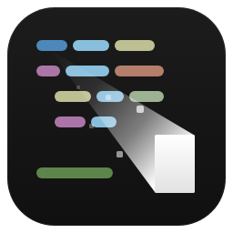
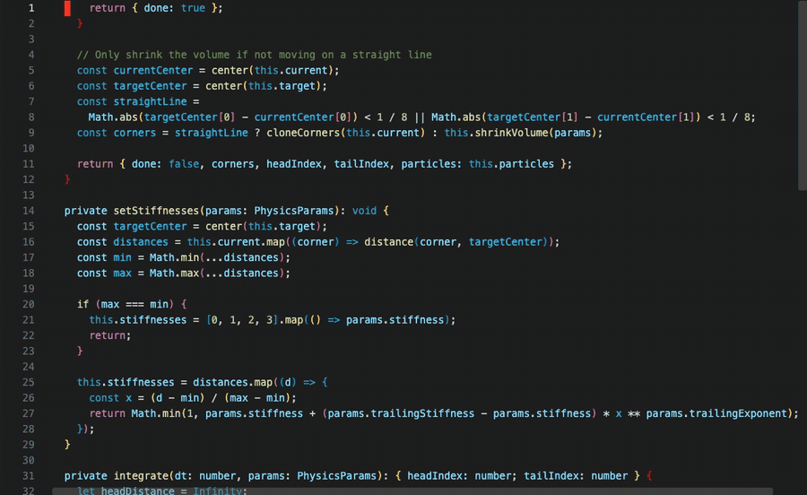

<div align="center">



# Smear Cursor for Visual Studio Code

**Animate the cursor with a smear effect.**  
A faithful Visual Studio Code port of [smear-cursor.nvim](https://github.com/sphamba/smear-cursor.nvim) by [sphamba](https://github.com/sphamba).

<p>
  <a href="https://marketplace.visualstudio.com/items?itemName=davellen.smear-cursor-vscode"><strong>Install Smear Cursor</strong></a>
</p>

<p>
  <a href="https://marketplace.visualstudio.com/items?itemName=davellen.smear-cursor-vscode"></a>&nbsp;&nbsp;
  &nbsp;&nbsp;
  <a href="https://github.com/daveleone/smear-cursor-vscode/actions/workflows/build.yml"></a>&nbsp;&nbsp;
  <a href="./LICENSE"></a>
</p>

<p>
  <a href="https://marketplace.visualstudio.com/items?itemName=davellen.smear-cursor-vscode"></a>&nbsp;&nbsp;
  <a href="https://open-vsx.org/extension/davellen/smear-cursor-vscode"></a>
</p>

</div>


## Features

- Smear animation driven by the same spring physics as smear-cursor.nvim
- Every smear-cursor.nvim option that makes sense in VS Code, with the same names and defaults
- Vector rendering: smooth edges, a continuous gradient and sub-character particles, where the Neovim plugin has to approximate with block characters
- Follows the theme's cursor color, or any color you pick
- Follows the cursor style, including mode changes made by [VSCodeVim](https://marketplace.visualstudio.com/items?itemName=vscodevim.vim) and [VSCode Neovim](https://marketplace.visualstudio.com/items?itemName=asvetliakov.vscode-neovim)
- Optional particles, for when a smear is not enough

---

## 🔥 Fire hazard

<details>
<summary>Show demo</summary>

<br>



</details>

---

## Installation

**From the Marketplace:**

1. Open the Extensions view in VS Code (`Ctrl+Shift+X` / `Cmd+Shift+X`)
2. Search for **Smear Cursor for Visual Studio Code**
3. Click **Install**

**Or via Quick Open:**

Launch Quick Open (`Ctrl+P` / `Cmd+P`), paste the command below, and press **Enter**:

```
ext install davellen.smear-cursor-vscode
```

The smear starts right away. The commands **Smear Cursor: Toggle**, **Smear Cursor: Enable** and **Smear Cursor: Disable** switch it on and off.

> [!TIP]
> The smear looks closest to Neovim with a block cursor: `"editor.cursorStyle": "block"`.

## Configuration

All settings live under `smearCursor.*` and map one-to-one to the smear-cursor.nvim options (`snake_case` becomes `camelCase`). Search for **Smear Cursor** in the Settings UI to browse them with descriptions and ranges.

<details>
<summary>Faster smear</summary>

<br>

```jsonc
{
  "smearCursor.stiffness": 0.8,                   // default 0.6   [0, 1]
  "smearCursor.trailingStiffness": 0.6,           // default 0.45  [0, 1]
  "smearCursor.stiffnessInsertMode": 0.7,         // default 0.5   [0, 1]
  "smearCursor.trailingStiffnessInsertMode": 0.7, // default 0.5   [0, 1]
  "smearCursor.damping": 0.95,                    // default 0.85  [0, 1]
  "smearCursor.dampingInsertMode": 0.95,          // default 0.9   [0, 1]
  "smearCursor.distanceStopAnimating": 0.5        // default 0.1   > 0
}
```

Lower `damping` (e.g. `0.65`) makes the smear bouncier: it overshoots the target.

</details>

<details>
<summary>Smooth cursor without smear</summary>

<br>

```jsonc
{
  "smearCursor.stiffness": 0.5,
  "smearCursor.trailingStiffness": 0.5
}
```

</details>

<details>
<summary>🔥 Fire hazard</summary>

<br>

```jsonc
{
  "smearCursor.cursorColor": "#ff4000",
  "smearCursor.particlesEnabled": true,
  "smearCursor.stiffness": 0.5,
  "smearCursor.trailingStiffness": 0.2,
  "smearCursor.trailingExponent": 5,
  "smearCursor.damping": 0.6,
  "smearCursor.gradientExponent": 0,
  "smearCursor.neverDrawOverTarget": true,
  "smearCursor.particleSpread": 1,
  "smearCursor.particlesPerSecond": 500,
  "smearCursor.particlesPerLength": 50,
  "smearCursor.particleMaxLifetime": 800,
  "smearCursor.particleMaxInitialVelocity": 20,
  "smearCursor.particleVelocityFromCursor": 0.5,
  "smearCursor.particleDamping": 0.15,
  "smearCursor.particleGravity": -50,
  "smearCursor.minDistanceEmitParticles": 0
}
```

</details>

### Colors

`smearCursor.cursorColor` accepts:

- empty (default): the theme's `editorCursor.foreground`, which follows theme changes
- a CSS color: `#d3cdc3`, `rgb(211 205 195)`, `orange`
- a theme color id: `terminal.ansiRed`, `editorError.foreground`
- `none`: the color of the text under the cursor

`smearCursor.cursorColorInsertMode` does the same for insert mode and falls back to `cursorColor`.

### Vim modes

With VSCodeVim or VSCode Neovim installed, the cursor style tells the extension the current mode: a block cursor means normal, a line means insert, an underline means replace. Insert mode then uses the `*InsertMode` parameters, and `smearInsertMode` / `smearReplaceMode` apply, as in Neovim. `smearCursor.modeDetection` controls this.

### Differences from smear-cursor.nvim

| smear-cursor.nvim | VS Code |
| --- | --- |
| `vertical_bar_cursor*`, `horizontal_bar_cursor_replace_mode` | `cursorShape`, which follows the editor cursor style by default |
| `smear_between_buffers` | `smearBetweenEditors`: only within the same editor group, because the extension API has no screen coordinates across groups |
| `filetypes_disabled` | `disabledLanguages` (language ids) |
| `distance_stop_animating_vertical_bar` | defaults to `0.1` instead of `0.875`, because thin bars are drawn exactly |
| `legacy_computing_symbols_support*`, `use_diagonal_blocks`, `max_slope_*`, `min_slope_vertical`, `max_angle_difference_diagonal`, `max_offset_diagonal`, `min_shade_no_diagonal*`, `max_shade_no_matrix`, `matrix_pixel_*`, `color_levels`, `gamma`, `cterm_*`, `particle_switch_octant_braille` | not needed: they tune the rasterization into characters |
| `max_kept_windows`, `windows_zindex`, `hide_target_hack`, `transparent_bg_fallback_color` | not needed: they work around terminal rendering |
| `smear_to_cmd`, `smear_terminal_mode`, `delay_after_key`, `delay_disable`, `particles_over_text` | not applicable |

## How it works

The extension API cannot draw over the editor. The smear is the `::before` pseudo-element of a text decoration on the cursor cell, absolutely positioned over the smear's bounding box. An SVG mask, regenerated every frame, cuts out the exact smear shape, gradient and particles. The color is a plain background, so theme colors work.

Known limitations:

- The real cursor stays visible: extensions cannot hide it
- With word wrap, smears across wrapped lines are misplaced vertically
- Only the primary cursor is animated
- Wide characters (CJK, some emoji) count as one column

## Development

```sh
npm install
npm test          # compile and run the unit tests
npm run package   # build a .vsix
```

Press <kbd>F5</kbd> in VS Code to launch an Extension Development Host with the extension loaded. Every push to `main` and every pull request builds the `.vsix` on GitHub Actions. Releases are automatic and follow [Conventional Commits](https://www.conventionalcommits.org): on `main`, a `feat:` commit releases a new minor version, `fix:` or `perf:` a patch, and a breaking change (`feat!:` or a `BREAKING CHANGE:` footer) a major one, with the `.vsix` attached to the GitHub release. Other types (`chore:`, `docs:`, `ci:`…) do not release. Versions come from the git tags, so `package.json` needs no manual bump.

| File | Role |
| --- | --- |
| `src/physics.ts` | Smear dynamics, ported from `animation.lua`, with no VS Code dependency |
| `src/scene.ts` | Turns a frame into the SVG mask and CSS |
| `src/renderer.ts` | Draws a scene as a decoration |
| `src/controller.ts` | Tracks the cursor, decides when to smear, runs the frame loop |
| `src/editor.ts` | Editor metrics, cursor shape and mode detection |
| `src/config.ts` | Settings, whose defaults live in `package.json` |

## Credits

This extension is a port of the original Neovim plugin created by **sphamba**:

🔗 [smear-cursor.nvim on GitHub](https://github.com/sphamba/smear-cursor.nvim)

The animation code is translated from smear-cursor.nvim, so this extension is released under the same GPL-3.0 license. All credit for the idea and the physics goes to the original author. This extension simply brings that experience to VS Code.

<div align="center">
<sub>If you enjoy Smear Cursor, consider leaving a ⭐ on the original GitHub repo of <a href="https://github.com/sphamba/smear-cursor.nvim">smear-cursor.nvim</a></sub>
</div>
